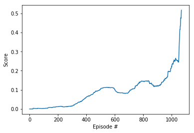

# bibo

### Goal
Train two agents (that control rackets) to play tennis against each other.

### Agent Implementation
This project uses an off-policy method called Multi Agent Deep Deterministic Policy Gradient (MADDPG) algorithm. [Paper](https://arxiv.org/abs/1706.02275)

The main concept behind this algorithm is summarized in this illustration taken from the paper:

> We accomplish our goal by adopting the framework of centralized training with
decentralized execution. Thus, we allow the policies to use extra information to ease training, so
long as this information is not used at test time. It is unnatural to do this with Q-learning, as the Q
function generally cannot contain different information at training and test time. Thus, we propose
a simple extension of actor-critic policy gradient methods where the critic is augmented with extra
information about the policies of other agents.

### Code Implementation

The code was modified from the "DDPG pendulum" tutorial from a the Udacity Deep Reinforcement Learning Repo.

The modifications are as follows:
- model.py: This file implements the Q-Network with the standard feed forward architecture.
  - Both critic and actor are 3-layered feed forward networks with ReLU activations.
  
- maddpg_agent.py: This file implements the learning agent itself along with the replay buffer and exploration noise.
  - The first modification was to introduce a defined interval for the learning procedure.
  - Second, the agent was modified to run simultaneously on multiple environments by having a shared buffer replay from which all agents can read and write.

The rest of the code remains nearly unchanged.


### MADDPG parameters and results
The MADDPG agent uses the following parameters values (defined in [maddpg_agent.py](maddpg_agent.py))

```
BUFFER_SIZE = int(1e6)  # replay buffer size
BATCH_SIZE = 128        # minibatch size
GAMMA = 0.95            # discount factor
TAU = 1e-3              # for soft update of target parameters
LR_ACTOR = 1e-4         # learning rate of the actor 
LR_CRITIC = 1e-3        # learning rate of the critic
WEIGHT_DECAY = 0        # L2 weight decay
```



The 2 agents were able to obtain +0.5 average reward for 100 episode in 1069 episodes.

### Future work
- Use Prioritized Experience Replay
